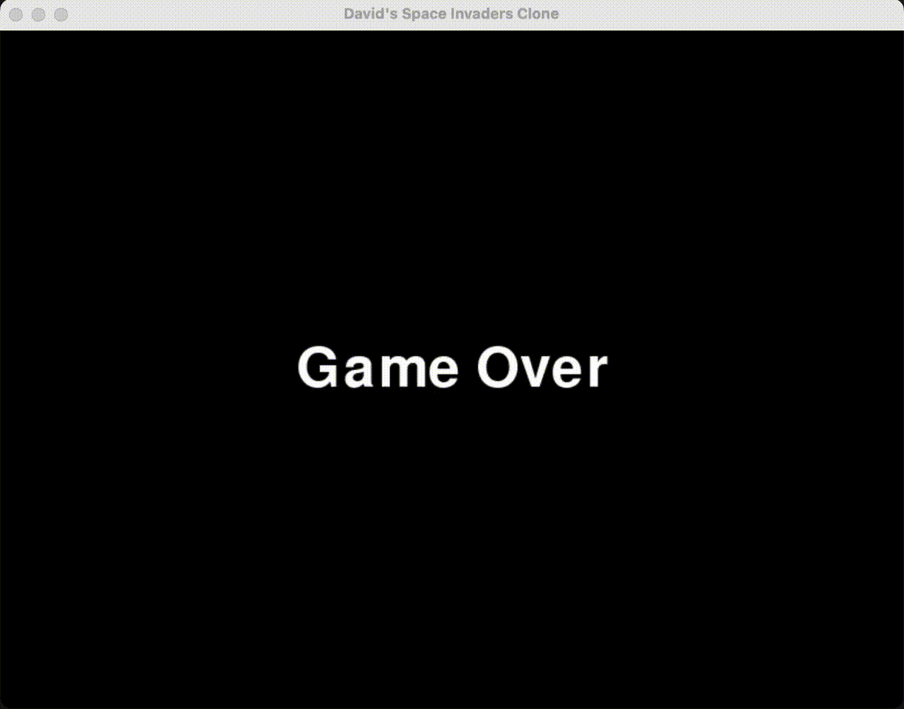

# David's Space Invaders



## Overview

- This is a simple Space Invaders clone without any bells and whistles.
- Goal of this project was simply to quickly understand the basics of [pygame](https://www.pygame.org/) and evaluate if it's suitable for further prototyping for **AI + Games**.
- My opinion: Pygame seems great for quick prototyping because it's simple and light weight. It's very easy to understand how everything works and hack something together. For more involved use cases involving textures, models and of course 3D, I will stick to Unity 3D.

## How to play

Defeat the space invaders by moving the ship left (←) and right (→) and shooting (Space).

## Installation

To install the necessary dependencies, first install conda, for example [miniconda](https://docs.anaconda.com/free/miniconda/). Then run:

```bash
make create_env
```

Afterwards run:

```bash
conda activate pygame_1
```

And finally run:

```bash
make run
```
